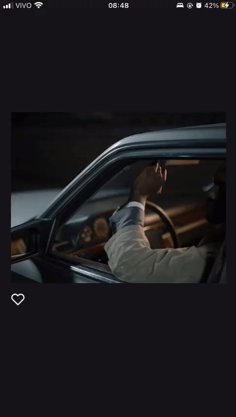

<h1 align="center">
    How to create the Instagram double tap like effect with react-native-reanimated
</h1>

<h3 align="center">
  <a target='_blank' to='https://medium.com/@gustavribeirod/330797726bc5'>
    React Native: Instagram “double tap” like effect with reanimated.
  </a>
</h3>

 

 
  

  &#xa0;

  <!-- <a href="https://instagramlikeeffect.netlify.app">Demo</a> -->

 
  <a to='https://github.com/Guribeiro/react-native-instagram-like-effect/tree/instagram-like-style'>
    go to app finished
  </a>

